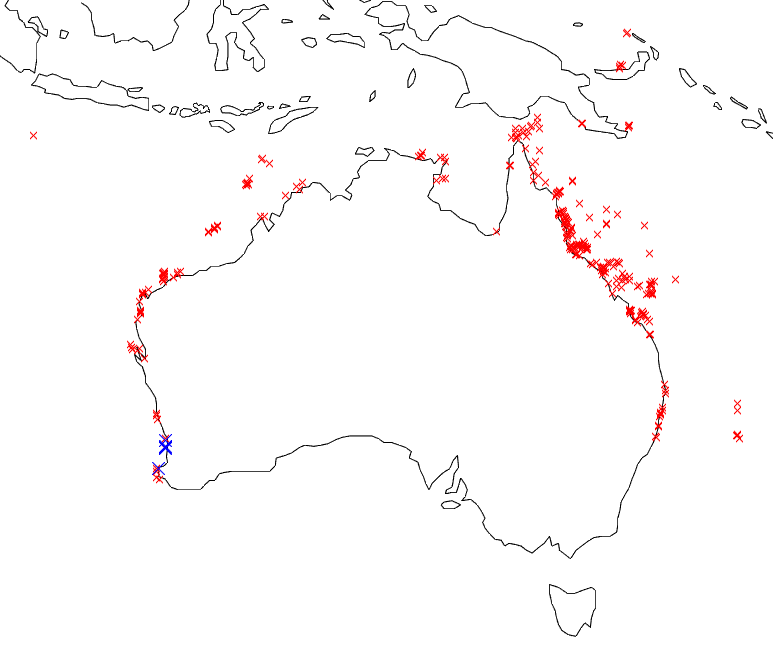

# The AIMS Temperature Data
## Raw Data
This Dataset is an enormous 27gb collection of temperature data from all over australia. The 27GB file has been interogated and the unique sites and subsites have been sorted into an unstructured text file using C code (faster than matlab when dealing with 27gb files).

This dataset has broken down their data collection sites into "sites" and "subsites", where some sites contain multiple subsites. Therefore to only include unique sites in our system we only include the subsites, (however our systems calls them sites). All of the sites and their subsites can be found in a text/csv in this directory, a few sites that do not have lat and lon in the large csv file have been filled with 0's for both Latitude and Longitude. 

The subsites have been plotted below 
 
The large Blue X's are the sites that have been imported into our system.

## Importing
The structure of the data in this document is a new line for each unique entry, with columns for details about the entry. There is only water temperature data in this dataset.
To import the data, the 27Gb file was split into 1Gb chunks and read in, in parts and then its skips sites that arent of 'Interest' then it matches the subsite id with our system and processes the data. 