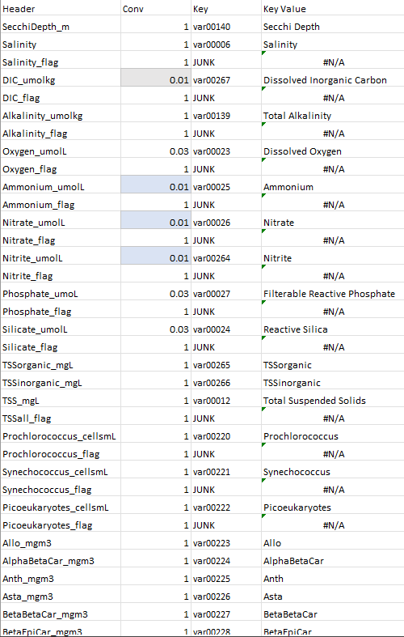
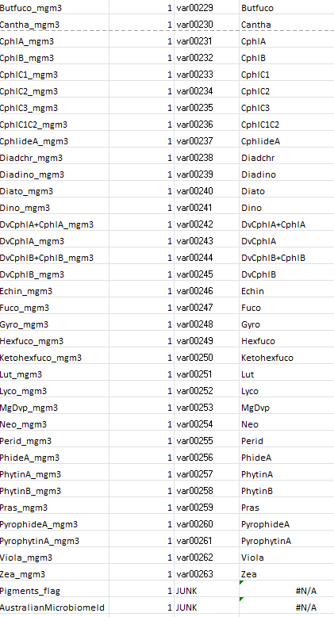
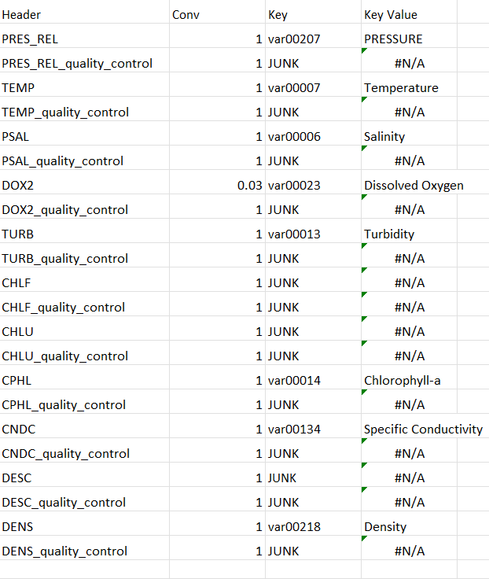

# Integrated Marine Observing System (IMOS)
## BioGeoChemical
    This data set is imported using the import_imos_bgc_2_csv.m function.
### Raw Data
The data for IMOS BGC is in a large table in a csv file. It has site, date and all of the variables as columns. The rows are new entries.

### Variables
 - Secchi Depth
 - Salinity
 - Dissolved Inorganic Carbon
 - Total Alkalinity
 - Dissolved Oxygen
 - Ammonium
 - Nitrate
 - Nitrite
 - Filterable Reactive Phosphate
 - Reactive Silica
 - TSSorganic
 - TSSinorganic
 - Total Suspended Solids
 - Prochlorococcus
 - Synechococcus
 - Picoeukaryotes
 - Allo
 - AlphaBetaCar
 - Anth
 - Asta
 - BetaBetaCar
 - BetaEpiCar
 - Butfuco
 - Cantha
 - CphlA
 - CphlB
 - CphlC1
 - CphlC2
 - CphlC3
 - CphlC1C2
 - CphlideA
 - Diadchr
 - Diadino
 - Diato
 - Dino
 - DvCphlA+CphlA
 - DvCphlA
 - DvCphlB+CphlB
 - DvCphlB
 - Echin
 - Fuco
 - Gyro
 - Hexfuco
 - Ketohexfuco
 - Lut
 - Lyco
 - MgDvp
 - Neo
 - Perid
 - PhideA
 - PhytinA
 - PhytinB
 - Pras
 - PyrophideA
 - PyrophytinA
 - Viola
 - Zea
### Conversion Table

## IMOS Profile
There are two importing codes import_imos_profile_2_csv and import_imos_profile_2_2010_csv these are then merged with the merger function called merge_files.m

### Raw Data
This dataset is a big table in a csv format. All the site details, date and variables are all columns. The rows are new entries.

###  Variables
 - PRESSURE
 - Temperature
 - Salinity
 - Dissolved Oxygen
 - Turbidity
 - Chlorophyll-a
 - Specific Conductivity
 - Density

### Conversion Table

## Temperature and Salinity Data
This data is imported via the function import_imos_amnm_adcp.m (formerly import_imos_temp_sal.m).

## Raw Data
This is a 1Gb csv, with a large header and a simple table structure with the variables as columns and rows are unique data points.

## Variables
 - Temperature
 - Salinity
 - Pressure

 ### Conversion table
    See IMOS Profile conversion table, Key Value should match the Variable Name

## IMOS Phytoplankton
The read me for IMOS Phytoplankton data can be found [here](./IMOSPHYTO/Readme.md)