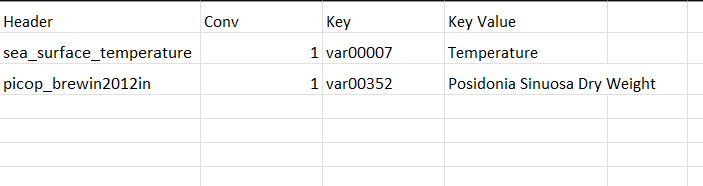

# IMOS Satelite Remote Sensing
    This data set is imported by  import_IMOS_SRS_L3S_netcdf_data, import_IMOS_SRS_MODIS_netcdf_data and import_IMOS_SRS_MODIS_OC3_netcdf_data.
    These functions extract the data from an .nc file and exports the data into our csv format.

## Variables
 - Temperature
 - Posidonia Sinuosa Dry Weight
 

## Conversion Table

