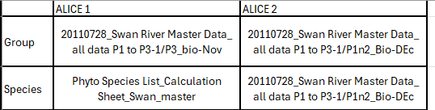

There are two files in the data lake for UWA AED, "20110728_Swan River Master Data_ all data P1 to P3-1.xlsx" and "Phyto Species List_Calculation Sheet_Swan_master.xls".

### 20110728_Swan River Master Data_ all data P1 to P3-1.xlsx
This document has lots of sheets all storing different data. The Sheets that got imported are "P1n2_Bio-DEc" and "P3_Bio-Nov"

These sheets contain a table with rows as unique entries and columns with all the details about the entry with the concentrations in cells/mL.

### Phyto Species List_Calculation Sheet_Swan_master.xls
This document contains phytoplankton concentrations in cells/mL, it has a new sheet for each new date. Each sheet contains two tables. One table for the surface concentrations and one for the seafloor concentrations. The tables both have the same structure, with each row being a different Species and each column being a different Site.

# Subset 1
Subset 1, contains two seperate files that gets imported. The Species data from subset one comes from Phyto Species List_Calculation Sheet_Swan_master. To import this document, the table starting and stopping locations were hardcoded for each sheet (mostly the same across the document). Then the table was iterated down and the plankton names were matched and iterated across and the site names were matched with our system and the concentrations processed for each site and plankton type pair for each date/sheet then all the dates are added to the same file to create a time series for each plankton and site pair.

The Group data from subset 1 comes from the sheet P3_Bio-Nov from 20110728_Swan River Master Data_ all data P1 to P3-1.xlsx. To import this sheet, the sheet is read in and the columns determined and the columns that are plankton types are matched to the plankton types we have in our system. Then for every row/entry in the site is matched and the concentration is processed.

# Subset 2
Subset 2, contains one file and imports from the same sheet ("P1n2_Bio-DEc" ) for Species and Group. To import this sheet, the sheet is read in and the columns determined and the columns that are plankton types (in this case both Species and Groups together). The Species and Groups are imported by seperate code. Depending on which is being ran, the columns are matched to our scheme of naming of plankton and the sites are also matched and the concentration is processed.

# Input Summary
