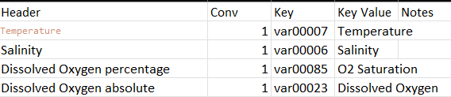

# Water Corporation Western Australia (WCWA)
This dataset is imported via 3 functions:
 - import_wc_digitised_dataset.m
 - import_wc_digitised_dataset_b.m
 - import_PhyWQ_1334_09.m

## PhyWQ_1334_09 Import code
    The code has been written for the particular structure of the file, the code reads in the excel spread sheet and then creates an internal datastructure of 3 dimension, Variable, Site and depth, so as the code stands now (17/05/2024) the data is 3x4x3 data cell with each position holding a large array of either data or a datenumber (2 objects of same structure, one to hold data, and one to hold dates associated with the data). Getting the data into this structure was achived by creating a list of the index locations (realtive to the big object structure). This decision was intended to cleanup the code however has made it hard to read. All that chunk of code is doing is telling where to store certain pieces of information. Once the data is inside this structured object, it simply loops through all elements because the required information is asociated with each layer of the object.

## Issues
    both import_wc_digitised_dataset.m and import_wc_digitised_dataset_b.m are still copy paste code, not functions for each file, I will update them if xlsread breaks.
    
## Variables
 - Temperature
 - Salinty
 - Dissolved Oxygen percentage
 - Dissolved Oxygen absolute

## Conversion Table

# Water Corporation Western Australia (WCWA) Phytoplankton
The phytoplankton imports have their own [readme](./Phytoplankton/Readme.md)