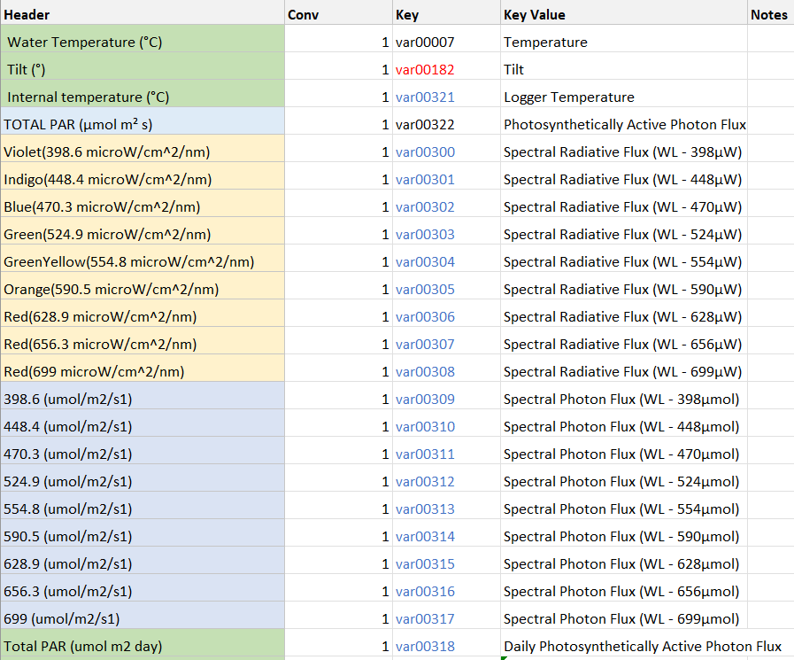

# WAMSI Theme 2
## Light
    This data set is imported via the function import_theme2_light.m

### Variables
 - Temperature
 - Tilt
 - Logger Temperature
 - Photosynthetically Active Photon Flux
 - Spectral Radiative Flux (WL - 398µW)
 - Spectral Radiative Flux (WL - 448µW)
 - Spectral Radiative Flux (WL - 470µW)
 - Spectral Radiative Flux (WL - 524µW)
 - Spectral Radiative Flux (WL - 554µW)
 - Spectral Radiative Flux (WL - 590µW)
 - Spectral Radiative Flux (WL - 628µW)
 - Spectral Radiative Flux (WL - 656µW)
 - Spectral Radiative Flux (WL - 699µW)
 - Spectral Photon Flux (WL - 398µmol)
 - Spectral Photon Flux (WL - 448µmol)
 - Spectral Photon Flux (WL - 470µmol)
 - Spectral Photon Flux (WL - 524µmol)
 - Spectral Photon Flux (WL - 554µmol)
 - Spectral Photon Flux (WL - 590µmol)
 - Spectral Photon Flux (WL - 628µmol)
 - Spectral Photon Flux (WL - 656µmol)
 - Spectral Photon Flux (WL - 699µmol)
 - Daily Photosynthetically Active Photon Flux

### Conversion

### Import Code
This code loops over the columns of the excel spreadsheet matching the variable names, then iterates over the two sites and determines which site is currently being processed.

## Seagrass
    This dataset is imported by import_theme2_seagrass.m
    
### Issues
    No dedicated Sheet for this agency in the variable key. The variables exist in the master key, but aren't being searched for and have each been hard coded. 

### Variables
    Variables taken from comments in code:
 - var00324	Posidonia Sinuosa Count
 - var00325	Posidonia Sinuosa Density
 - var00326	Posidonia Sinuosa Above Ground Biomass
 - var00327	Posidonia Sinuosa Below Ground Biomass
 - var00351	Posidonia Sinuosa Total Biomass