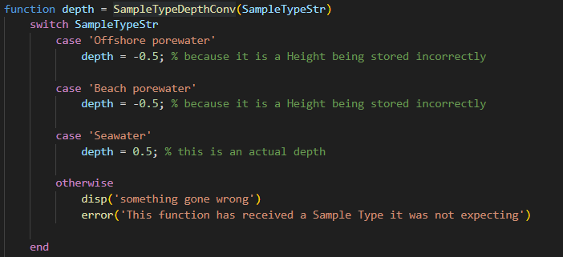

# WAMSI 3.3 Pore Water Readme
This data set contains details about disolved metals in the water in the water column and beneath the seabed (in the pores).

## Code
This dataset is imported by the script "importPore.m". This code reads in one excel file however it has 3 sheets. The code is chunked to handle each sheet seperately because they all have different variables structure and naming schemes.

### Insitu
This sheet contains details about the site, for seawater entries the depth is noted down. So this code reads in what type of sample this is and if its water then It reads that in, if its blank, it gives the default answer of 0.5m from respective boundry.
. Where porewater measurements are taken below the seabed, so its measured from the seabed and going down into the seabed, which under our conventions for "height" would negative, because its below the seabed.

### MAFRL
This sheets contains the values of dissolved metals in the water. This sheet contains minimum values based off the instruments sensitivity, these have been included as "<0.009" for instance. This is good for transpearncy however our system cannot handle this so, this code interprets this as half of the smallest increment. so "0.0045" in this case. Then the site and variables are matched and processes.

### CCWA
Not Finished