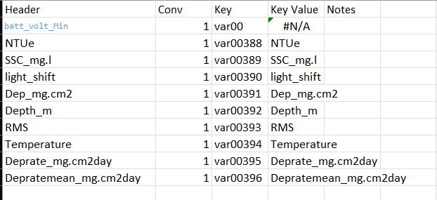

# Wamsi Theme 3 SEDDEPO
    The Sediment Deposition logger data. This is imported using the matlab script IMPORTSEDDEPO.m
## Raw Data
    The raw data contains "NA" as its place holder for values that dont exist.
## Variables
 - batt_volt_Min
 - NTUe
 - SSC_mg.l
 - light_shift
 - Dep_mg.cm2
 - Depth_m
 - RMS
 - Temperature
 - Deprate_mg.cm2day
 - Depratemean_mg.cm2day

## Notes
    The variables have not been renamed yet, see also the gitgub.

## Conversions
