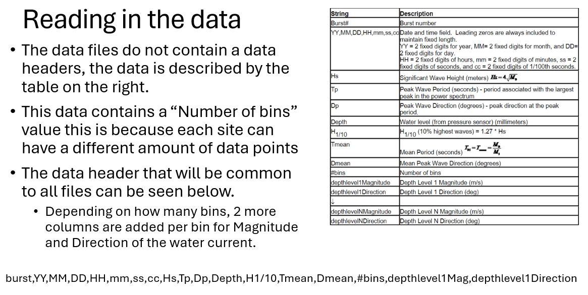
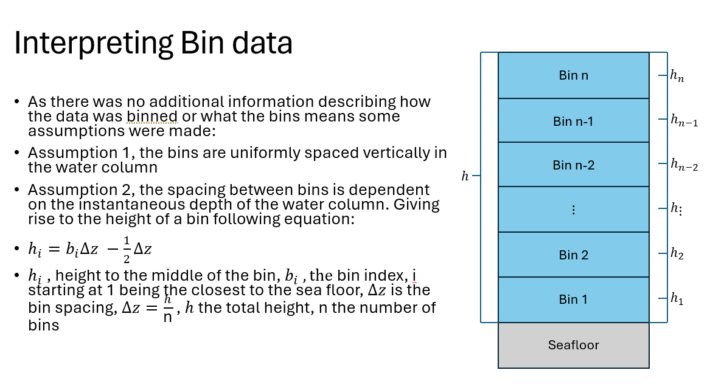

# WAMSI 5 Waves
This dataset is exported as a matfile and also partially imported into our system. The matfile contains all of the data in the dataset/data lake directory structure.

The complete matfile can be created by running the matlab script "WavesTableMatfile.m". This dataset does not have data heading but came with a data information pdf[(PDF of data Layout)](../../../../../data-lake/WAMSI/WWMSP5/WWMSP5_waves/Waves.pdf).

This pdf was used to import the data, a snippet can be seen in the right of this powerpoint slide.

Once the data has been read in, there is still an element of interpretation, where does the binning numbers start. We made the assumptions summarised below in another powerpoint slide.

It was mentioned that this dataset is only partially imported into our system (however fully imported into a standalone matfile) that is because of the binned data. We could not decide how best to include one variable that contains multiple depths. (Treat each depth as a new variable, collate all into all depths into the one csv that varies with time and depth, or potentially something else entirely)

